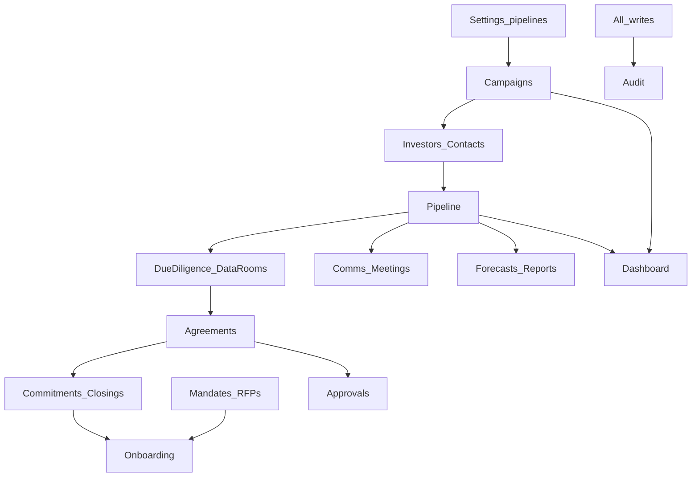

# Fundraising — Stages index (master journey)

**Sources:** [`fundraising-srd.md`](./fundraising-srd.md) · [`fundraising-frontend.md`](./fundraising-frontend.md) · [`arcus-feature-delivery-playbook.md`](./arcus-feature-delivery-playbook.md)  
**Handoff:** [`fundraising-handoff.md`](./fundraising-handoff.md)  
**UI shell:** `app/fundraising/*`, `components/fundraising/*` (mock data; no live API yet)

This index is the map. Each sidebar tab has its own stages MD (FP&A Model Planning style: Who / Goal / Steps / Done when / FE now vs BE blocked).

---

## How to use

1. Pick a tab stages MD (or follow **build order** below).
2. Say “moving to Stage N” for that tab.
3. Agent audits UI → implements FE slice **or** writes `fundraising-<tab>-backend-asks.md`.
4. You test in the browser → feedback → next stage / next tab.

Do **not** pretend live data. Replace mocks stage-by-stage with honest empty/error states until APIs exist.

---

## Cross-tab product spine

```
[Settings: pipelines / gates / amount types]
        ↓
[Campaigns: create → approve → activate]
        ↓
[Investors + Contacts: master org + people]
        ↓
[Pipeline: opportunities + stage moves]
        ↓
[Comms + Meetings/Tasks]     [Due Diligence + Data Rooms + Documents]
        ↓                              ↓
[Agreements & e-sign] ←───────────────┘
        ↓
[Commitments & Closings]  (PE/VC)
        ↓
[Client Onboarding]  ← also [Mandates & RFPs] (AM path)
        ↓
[Approvals]  (concessions, campaign activation, stage overrides)
        ↓
[Forecasts + Reports + Dashboard]  (read live aggregates last)
        ↓
[Audit]  (immutable trail of material writes)
+ [Placement Agents]  (can start after Campaigns / Pipeline)
```



---

## Recommended build order

Dependency order (not sidebar order). First implementation starts when you say so.

| Order | Tab(s) | Why |
|------:|--------|-----|
| 1 | [Settings](./fundraising-settings-stages.md) | Pipelines, stage gates, amount types foundation |
| 2 | [Campaigns](./fundraising-campaigns-stages.md) | Opportunity parent; activation gates |
| 3 | [Investors](./fundraising-investors-stages.md) + [Contacts](./fundraising-contacts-stages.md) | Master relationship records |
| 4 | [Pipeline](./fundraising-pipeline-stages.md) | Opportunities + server stage validation |
| 5 | [Communications](./fundraising-communications-stages.md) + [Meetings](./fundraising-meetings-stages.md) | Activity and follow-ups |
| 6 | [Due Diligence](./fundraising-due-diligence-stages.md) + [Data Rooms](./fundraising-data-rooms-stages.md) + [Documents](./fundraising-documents-stages.md) | Evidence and secure sharing |
| 7 | [Agreements](./fundraising-agreements-stages.md) → [Commitments](./fundraising-commitments-stages.md) → [Onboarding](./fundraising-onboarding-stages.md) | Legal → capital → activation |
| 8 | [Mandates](./fundraising-mandates-stages.md) | AM path (can parallel after Investors) |
| 9 | [Placement Agents](./fundraising-placement-agents-stages.md) | Appointments scoped to opportunities |
| 10 | [Approvals](./fundraising-approvals-stages.md) + [Audit](./fundraising-audit-stages.md) | Gates + immutable trail |
| 11 | [Forecasts](./fundraising-forecasts-stages.md) + [Reports](./fundraising-reports-stages.md) + [Dashboard](./fundraising-dashboard-stages.md) | Live KPIs last |

---

## Per-tab stages files

| Tab | Route | Stages MD | Component |
|-----|-------|-----------|-----------|
| Dashboard | `/fundraising` | [fundraising-dashboard-stages.md](./fundraising-dashboard-stages.md) | `fundraising-dashboard.tsx` |
| Campaigns | `/fundraising/campaigns` | [fundraising-campaigns-stages.md](./fundraising-campaigns-stages.md) | `fundraising-campaigns.tsx` |
| Investor Organisations | `/fundraising/investors` | [fundraising-investors-stages.md](./fundraising-investors-stages.md) | `fundraising-investors.tsx` |
| Contacts | `/fundraising/contacts` | [fundraising-contacts-stages.md](./fundraising-contacts-stages.md) | `fundraising-contacts.tsx` |
| Pipeline | `/fundraising/pipeline` | [fundraising-pipeline-stages.md](./fundraising-pipeline-stages.md) | `fundraising-pipeline.tsx` + board |
| Mandates & RFPs | `/fundraising/mandates` | [fundraising-mandates-stages.md](./fundraising-mandates-stages.md) | `fundraising-mandates.tsx` |
| Due Diligence | `/fundraising/due-diligence` | [fundraising-due-diligence-stages.md](./fundraising-due-diligence-stages.md) | `fundraising-due-diligence.tsx` |
| Data Rooms | `/fundraising/data-rooms` | [fundraising-data-rooms-stages.md](./fundraising-data-rooms-stages.md) | `fundraising-data-rooms.tsx` |
| Communications | `/fundraising/communications` | [fundraising-communications-stages.md](./fundraising-communications-stages.md) | `fundraising-communications.tsx` |
| Meetings & Tasks | `/fundraising/meetings` | [fundraising-meetings-stages.md](./fundraising-meetings-stages.md) | `fundraising-meetings.tsx` |
| Documents | `/fundraising/documents` | [fundraising-documents-stages.md](./fundraising-documents-stages.md) | `fundraising-documents.tsx` |
| Agreements & Signatures | `/fundraising/agreements` | [fundraising-agreements-stages.md](./fundraising-agreements-stages.md) | `fundraising-agreements.tsx` |
| Commitments & Closings | `/fundraising/commitments` | [fundraising-commitments-stages.md](./fundraising-commitments-stages.md) | `fundraising-commitments.tsx` |
| Client Onboarding | `/fundraising/onboarding` | [fundraising-onboarding-stages.md](./fundraising-onboarding-stages.md) | `fundraising-onboarding.tsx` |
| Placement Agents | `/fundraising/placement-agents` | [fundraising-placement-agents-stages.md](./fundraising-placement-agents-stages.md) | `fundraising-placement-agents.tsx` |
| Forecasts & Analytics | `/fundraising/forecasts` | [fundraising-forecasts-stages.md](./fundraising-forecasts-stages.md) | `fundraising-forecasts.tsx` |
| Reports | `/fundraising/reports` | [fundraising-reports-stages.md](./fundraising-reports-stages.md) | `fundraising-reports.tsx` |
| Approvals | `/fundraising/approvals` | [fundraising-approvals-stages.md](./fundraising-approvals-stages.md) | `fundraising-approvals.tsx` |
| Audit Logs | `/fundraising/audit` | [fundraising-audit-stages.md](./fundraising-audit-stages.md) | `fundraising-audit.tsx` |
| Settings | `/fundraising/settings` | [fundraising-settings-stages.md](./fundraising-settings-stages.md) | `fundraising-settings.tsx` |

**Nav note:** SRD lists Meetings/Tasks, Commitments/Closings, Forecasts/Analytics separately. FE combines them; stages MDs follow FE tabs and call out internal sub-tabs.

---

## Status table (module-wide)

| Tab | Stages MD | UI today | Live API | Notes |
|-----|-----------|----------|----------|-------|
| Dashboard | Written | Mock shell | No | Build last for live KPIs |
| Campaigns | Written | Mock + wizard | No | Activation gates missing |
| Investors | Written | Directory + shallow detail | No | Not full Investor 360 yet |
| Contacts | Written | Table + detail | No | Influence taxonomy inconsistency |
| Pipeline | Written | Overview + board | No | No DnD / server stage validation |
| Mandates | Written | Table + wizard | No | Coarse stages vs SRD AM pipeline |
| Due Diligence | Written | Matrix + Q&A | No | DDQ lifecycle incomplete |
| Data Rooms | Written | Rooms + detail | No | Permissions/security stubs |
| Communications | Written | Log + wizard | No | Opportunity link missing |
| Meetings & Tasks | Written | Dual tabs | No | Weak entity links |
| Documents | Written | Library + versions UI | No | No real file I/O |
| Agreements | Written | List + e-sign mock | No | Version invalidation banner only |
| Commitments | Written | Register + closing UI | No | Closings not full SRD entities |
| Onboarding | Written | Cases + checklist | No | Activation gates incomplete |
| Placement Agents | Written | Appointments | No | No scoped agent access |
| Forecasts | Written | Scenarios + charts | No | Assumptions do not recalc |
| Reports | Written | Catalog cards | No | Runs are toasts |
| Approvals | Written | Inbox | No | Not wired from other tabs |
| Audit | Written | Event log | No | Not fed by live writes |
| Settings | Written | 5 config tabs | No | Amount types incomplete vs SRD |

---

## Guardrails (never violate while building)

See [`fundraising-frontend.md`](./fundraising-frontend.md). Highlights: independent amount types; signed ≠ cash; awarded ≠ activated AUM; stage moves server-authoritative; no duplicate investor orgs; internal notes stay internal; compliance blocks Admit/Fund/Activate.
